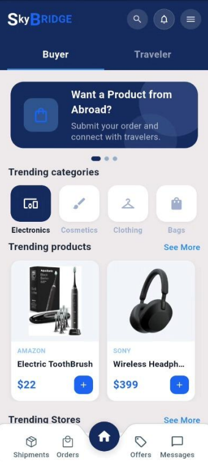
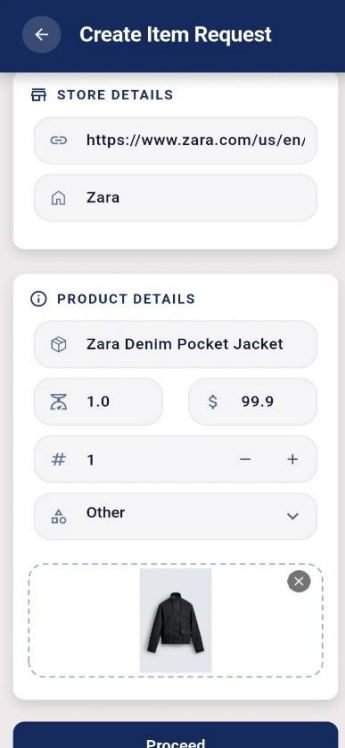
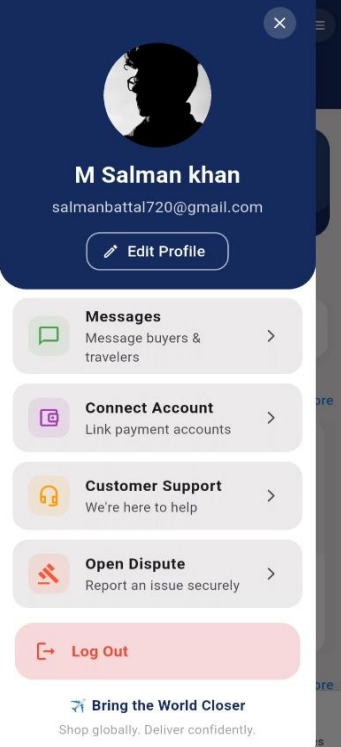
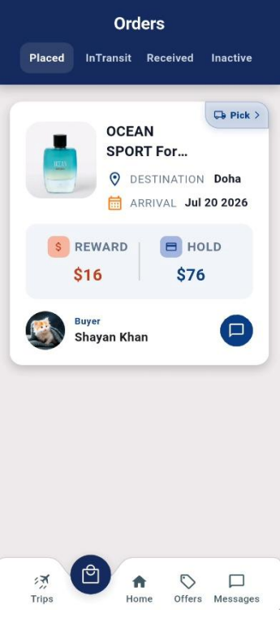
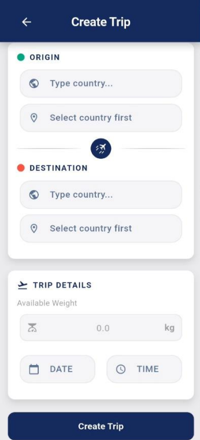
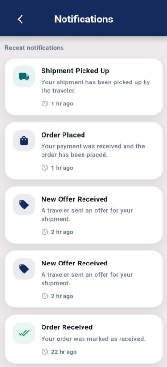
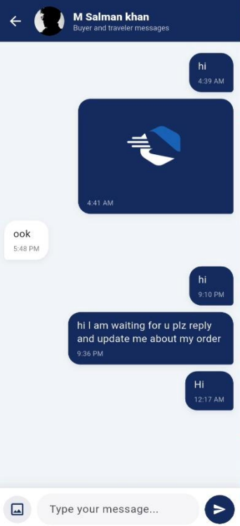
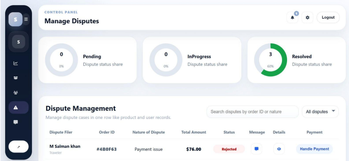
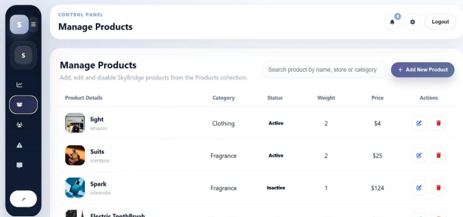

<p align="center">
  
</p>

<h1 align="center"> SkyBridge</h1>

<p align="center">
A Full-Stack Logistics & Shipment Management Platform
</p>

<p align="center">


</p>

---

#  Overview

SkyBridge is a full-stack logistics and shipment management platform developed as a **Final Year Project (FYP)**. The platform connects **buyers, travelers, and administrators** through a secure digital ecosystem that simplifies shipment booking, order management, payment processing, and dispute resolution.

The project consists of:

-  Flutter Mobile Application
-  React Admin Dashboard
-  Node.js & Express Backend
-  MongoDB Database
-  Firebase Authentication & Notifications
-  Stripe Payment Integration
-  Cloudinary Image Storage

---

#  Key Features

##  User Mobile Application

- User Registration & Login
- Secure Firebase Authentication
- Buyer & Traveler Modules
- Shipment Booking
- Product Requests
- Trip Creation
- Offer Management
- Order Management
- Shipment Tracking
- Stripe Payment Integration
- Cloudinary Image Upload
- Real-time Chat
- Push Notifications
- Ratings & Reviews
- User Profile Management

---

##  Admin Dashboard

- Dashboard Overview
- User Management
- Account Management
- Product Management
- Order Management
- Dispute Management
- Payment Monitoring
- Analytics & Reports
- Profile Management

---

##  Backend

- RESTful API
- Firebase Authentication
- MongoDB Database
- Cloudinary Integration
- Stripe Payment Processing
- Secure Middleware
- Role-Based Authorization
- Modular API Architecture

---

#  System Architecture

```text
Flutter Mobile App
        │
        ▼
REST API (Node.js + Express)
        │
        ▼
MongoDB Database
        │
 ┌──────────────┬─────────────┐
 ▼              ▼             ▼
Firebase      Stripe      Cloudinary
```

---

#  Tech Stack

| Category | Technologies |
|-----------|--------------|
| Mobile App | Flutter, Dart |
| Admin Dashboard | React.js |
| Backend | Node.js, Express.js |
| Database | MongoDB |
| Authentication | Firebase Authentication |
| Image Storage | Cloudinary |
| Payments | Stripe |
| Version Control | Git & GitHub |

---

#  Project Structure

```text
SkyBridge
│
├── Assets
│   ├── logo.png
│   └── Screenshots
│
├── Client
│   ├── User
│   │   └── Flutter Application
│   │
│   └── Admin
│       └── React Dashboard
│
├── Server
│   ├── config
│   ├── middleware
│   ├── models
│   ├── routes
│   ├── utils
│   ├── package.json
│   └── server.js
│
├── README.md
└── .gitignore
```

---

#  Getting Started

## Clone Repository

```bash
git clone https://github.com/Msk720/SkyBridge.git
```

---

## Install User Application

```bash
cd Client/User
flutter pub get
flutter run
```

---

## Install Admin Dashboard

```bash
cd Client/Admin
npm install
npm start
```

---

## Install Backend Server

```bash
cd Server
npm install
npm start
```

---

#  Environment Variables

Create a `.env` file inside the **Server** directory.

```env
PORT=

MONGODB_URI=

JWT_SECRET=

FIREBASE_PROJECT_ID=

STRIPE_SECRET_KEY=

CLOUDINARY_CLOUD_NAME=

CLOUDINARY_API_KEY=

CLOUDINARY_API_SECRET=
```

---

#  Screenshots

##  User Mobile Application

| Login | Home |
|-------|------|
|  |  |

| Product Request | Navigation Menu |
|-----------------|-----------------|
|  |  |

| Order Dashboard | Create Trip |
|-----------------|-------------|
|  |  |

| Notifications | Chat |
|--------------|------|
|  |  |

---

##  Admin Dashboard

| Dispute Management | Product Management |
|--------------------|--------------------|
|  |  |

---

#  Future Improvements

- Live Shipment Tracking
- AI-based Shipment Recommendations
- Advanced Analytics Dashboard
- Multi-language Support
- Dark Mode
- Driver Mobile Application
- Email Notifications
- Performance Optimization

---

#  Author

**Salman Khan**

Computer Science Graduate  
Flutter Developer | Aspiring Software Engineer

- **GitHub:** https://github.com/Msk720
- **LinkedIn:** https://www.linkedin.com/in/salman-khan-5a8974292

---

#  Support

If you found this project useful, consider giving it a ⭐ on GitHub.

---